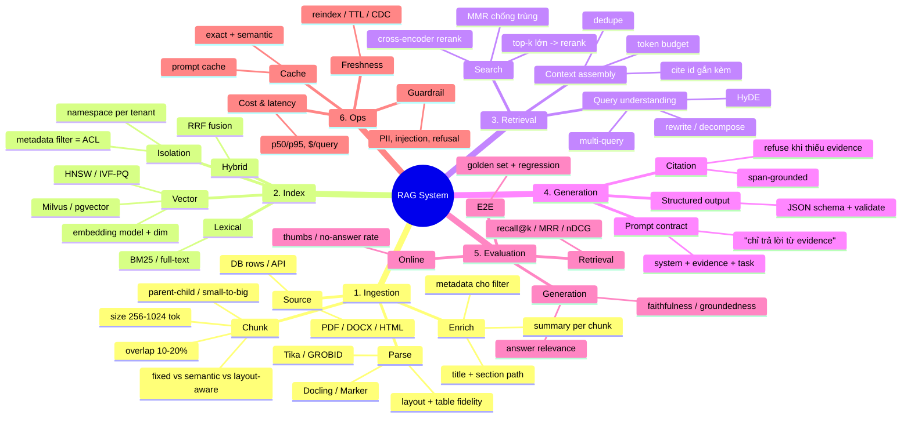
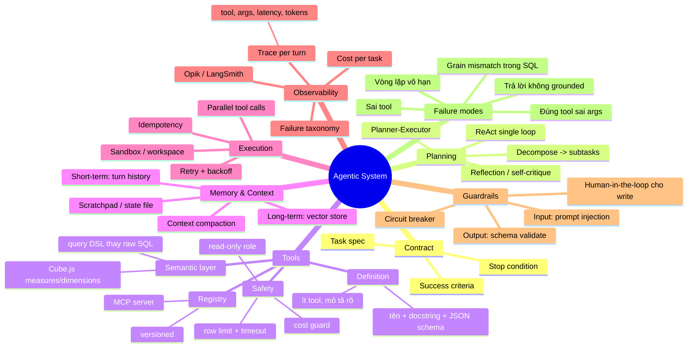
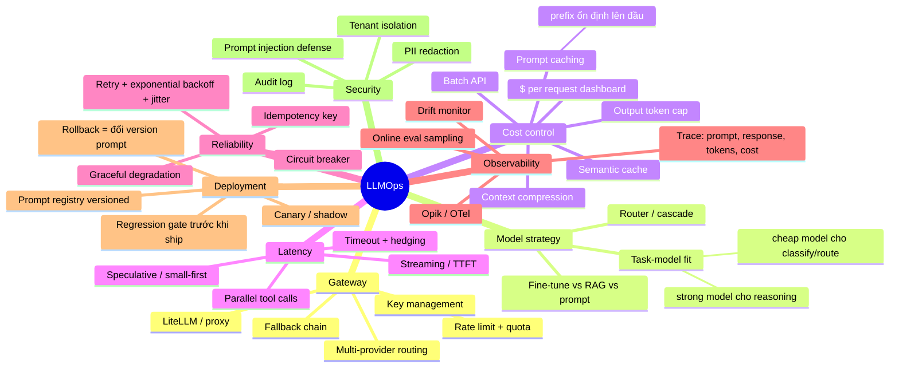
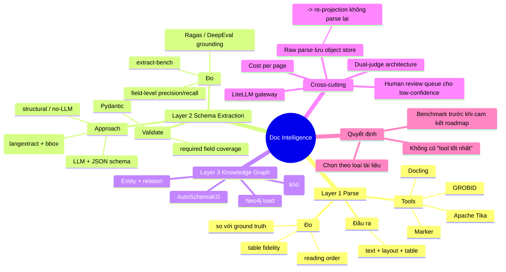

# Phần 1 — Mind Map: Design & Architect hệ thống AI/LLM

> 5 mind map = 5 "khung xương" bạn phải vẽ được trên whiteboard trong 3 phút.
> Cách ôn: che file lại → vẽ lại từ trí nhớ → mở ra so → chỉ học lại nhánh bị thiếu.
> Mỗi map có mục **"Nói được 5 câu này"** — đó là phần interviewer thực sự chấm.

---

## MAP 1 — RAG System (Retrieval-Augmented Generation)

RAG không phải "LLM + vector database"; nó là một hệ thống gồm ingestion → indexing → retrieval → evidence-grounded generation → evaluation → operations, trong đó retrieval quality, data fidelity và access isolation quyết định phần lớn chất lượng cuối cùng.
Map 1 tập trung vào: 
"Làm sao lấy đúng evidence?"




**Nói được 5 câu này**
1. "RAG hỏng ở retrieval nhiều hơn ở generation — nên tôi đo recall@k trước khi động vào prompt."
2. "Hybrid = BM25 + vector, fuse bằng RRF, vì vector chết ở exact match (mã lỗi, part number)." 
*** Hybrid search ***

"BM25 + vector + RRF."

→ Semantic search không thay thế exact search.

3. "Chunk theo layout/section, không theo ký tự — parse layer quyết định chất lượng RAG (tôi đã benchmark Docling/Marker/Tika/GROBID trên 13 PDF có gold JSON)."
*** Parsing/chunking matters ***

"Chunk theo layout/section, không theo ký tự."

→ RAG quality bắt đầu từ ingestion, không phải từ LLM.

4. "Không có evidence thì phải từ chối. No-answer rate là metric, không phải bug."
 *** Refusal is a feature ***

"Không có evidence thì từ chối."

→ Không hallucinate để tăng apparent answer rate.

5. "Isolation bằng namespace/metadata filter ở tầng index, không lọc sau khi truy hồi."

Security at retrieval

"Isolation ở index/retrieval layer."

→ Không được retrieve dữ liệu trái quyền rồi mới filter.

### Nếu nhìn toàn bộ MAP như một pipeline

```
              RAG SYSTEM
                  │
                  ▼
           ① INGESTION
       Parse → Chunk → Enrich
                  │
                  ▼
             ② INDEX
       Vector + BM25 + Hybrid
                  │
                  ▼
           ③ RETRIEVAL
    Query → Search → Rerank → MMR
                  │
                  ▼
          Context + Evidence
                  │
                  ▼
           ④ GENERATION
      LLM + Structured Output
                  │
                  ▼
         Answer + Citation
                  │
                  ▼
           ⑤ EVALUATION
      Retrieval → Generation → E2E
                  │
                  ▼
               ⑥ OPS
     Cost / Latency / Freshness
           / Cache / Guardrail

```

---

## MAP 2 — Agent & Tool-Use System (NL-to-SQL / Analytics Agent)
MAP 2 này mô tả kiến trúc của một AI Agent có khả năng làm việc thật với data/tools, đặc biệt phù hợp với NL-to-SQL / Analytics Agent như PR Analytics Agent của bạn.
MAP 2 tập trung vào:

"Làm sao để Agent tự quyết định phải làm gì, gọi tool nào, thực thi thế nào và biết khi nào nên dừng?"

Đây là case DOGFOOD Github PR Analytic Agent, thật sự nằm ở Agent loop:

Can the Fabrion Coding Agent understand the task → choose the right MCP tool → execute → verify the result → recover from failures → stop when done, without an user has to take over?

Đó mới là câu hỏi mà DOG-1 đang thử nghiệm. Phần GitHub → Airbyte → ClickHouse → dbt → Cube là workload; còn cách Agent hoàn thành workload đó mới là dogfood signal.


```
             DOG-1 PR ANALYTICS AGENT

GitHub
  │
  ▼
Airbyte MCP
  │
  ▼
AnalyticsStore / ClickHouse
  │
  ▼
dbt
  │
  ▼
gold_pr_analytics
  │
  ▼
Cube Semantic Layer
  │
  ▼
FabrionCubeMCP
  │
  ▼
Fabrion Agent
  │
  ├── Contract
  ├── Planning
  ├── Tool use
  ├── Execution
  ├── Guardrails
  └── Observability
  │
  ▼
4 Canonical Questions
  │
  ▼
EvalComponent
  │
  ▼
Opik Scorecard
```




**Nói được 5 câu này**
1. "Tôi cho agent query semantic layer (Cube) chứ không sinh raw SQL — nó loại bỏ cả một lớp hallucination về join và grain."
① Semantic layer > raw SQL

"Tôi cho Agent query Cube thay vì sinh raw SQL."

Mục tiêu là giảm hallucination về: joins, grain, metrics
2. "Tool description chính là prompt. Sai tool thường là lỗi mô tả tool, không phải lỗi model."

Nếu tool schema/documentation tệ → Agent tệ dù model rất mạnh.
3. "Mỗi turn phải có trace: tool nào, args gì, bao nhiêu token, hết bao nhiêu tiền — không có telemetry thì không debug được agent, không biết tại sao Agent fail."
4. "Agent phải có stop condition và budget; loop vô hạn là failure mode phổ biến nhất trong production." Budget + stop condition

"Agent phải biết khi nào dừng."

Không phải cứ còn token là tiếp tục reasoning/tool calls.
5. "Write action luôn qua human-in-the-loop hoặc dry-run; read dùng role read-only + LIMIT + timeout."


---

## MAP 3 — LLM Evaluation Harness (thế mạnh của bạn — LAAF)

```mermaid
mindmap
  root((Eval Harness))
    Dataset
      Golden set
        curated, versioned
        schema-validated JSONL
      Coverage
        happy / edge / adversarial
      Anti-leak
        hidden test suite
        gold không lộ cho agent
    Scorers
      Tier 1 Deterministic
        execution equivalence
        rowset compare
        structural check
        safety gate G (0/1)
        -> quyết định PASS/FAIL
      Tier 2 LLM Judge
        rubric tuyệt đối + anchor
        temp 0, judge_model cố định
        cross-family judge
        -> chỉ advisory
      Invariant
        judge KHÔNG lật được deterministic
    Controls
      Null agent -> phải 0 điểm
      Cheater agent -> phải 0 điểm
      Mutant impl -> test phải fail
    Protocol
      N trials (>=3) đo reliability
      pass@1 / pass@k
      giữ model + prompt cố định
      fingerprint scorer code
    Metrics
      Correctness
      Cost / tokens / turns
      Latency p50 p95
      Variance giữa trials
    Failure analysis
      Taxonomy
        Grain Mismatch
        Contract Violation
        Logic Error
      Recovery loop
        grader reason -> tag -> re-prompt
        pass@Round2
    Trust
      Reproducibility
      Quarantine kết quả nhiễu
      Regression gate trong CI
```

**Nói được 5 câu này**
1. "Kiến trúc 2 tier: code quyết định PASS/FAIL, LLM judge chỉ advisory. Grader là source of truth."
2. "Null agent và cheater agent là bắt buộc — chúng chứng minh grader bắt được cả việc *không làm gì* lẫn việc *gian lận*."
3. "Chạy 3 trial/task vì một lần pass không phải là reliability; tôi báo cáo cả variance của cost."
4. "Tôi từng phát hiện kết quả eval bị sai do infra hỏng và resource contention → quarantine và republish lịch sử, vì quyết định engineering phải dựa trên đo lường tái lập được."
5. "Recovery controller map lỗi grader → taxonomy → re-prompt có định hướng, nhưng **không bao giờ** inject gold answer."

---

## MAP 4 — LLMOps: Serving, Cost & Reliability



**Nói được 5 câu này**
1. "Prompt là artifact có version, nằm trong registry (tôi dùng Opik) — rollback nghĩa là đổi version, không phải sửa code."
2. "Gateway (LiteLLM) cho tôi đổi model mà không đổi app code, và cho tôi một chỗ duy nhất để đo cost/latency."
3. "Đặt phần prefix ổn định lên đầu prompt để ăn prompt cache — đây là cách giảm cost dễ nhất mà không đụng chất lượng."
4. "Không ship prompt mới nếu chưa qua regression gate trên golden set."
5. "Degradation phải có kịch bản: model chính chết → fallback model yếu hơn + báo cho user, chứ không trả lời sai im lặng."

---

## MAP 5 — Document Intelligence Pipeline (Doc → Structured)



**Nói được 5 câu này**
1. "Ingestion tài liệu là 3 tầng riêng biệt (parse → extract → graph), không phải một tool thay thế lẫn nhau — đánh giá phải theo từng tầng."
2. "Tôi lưu raw parse vào object storage để re-project sang schema mới mà không phải parse lại — parse là phần đắt nhất."
3. "Span-grounded extraction (giá trị link về bounding box trong PDF) là cách rẻ nhất để audit hallucination."
4. "Tôi dùng dual-judge để giảm bias một model, và Ragas/DeepEval cho grounding metric."
5. "Kết luận benchmark của tôi trực tiếp đổi roadmap ingestion — đó là mục đích của eval, không phải để có dashboard đẹp."

---

## Cách dùng 5 map này khi phỏng vấn

Khi được hỏi *"Design a system that..."* — luôn theo thứ tự này (nói to trước khi vẽ):

1. **Clarify** — user là ai? volume? latency SLA? độ chính xác cần bao nhiêu? có được sai không?
2. **Đề xuất metric TRƯỚC kiến trúc** — "trước hết tôi định nghĩa thế nào là đúng, rồi mới thiết kế." Đây là điểm khác biệt của bạn so với ứng viên khác.
3. **Vẽ đường đi chính (happy path)** — ingestion → index → retrieve → generate → serve.
4. **Thêm eval + observability** — golden set, regression gate, trace, cost.
5. **Nói failure modes & guardrail** — hallucination, injection, cost blowup, model outage.
6. **Trade-off** — chỗ nào bạn chọn đơn giản, và điều kiện nào sẽ khiến bạn đổi ý.
