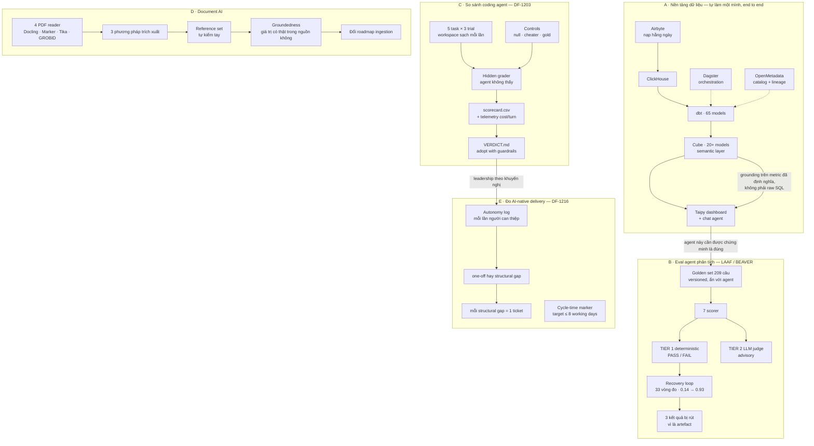
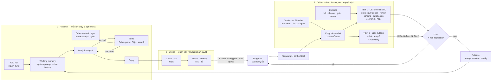

# Phần 6 — Bản đồ dự án Fabrion (và đánh giá diagram "Harness / Loop / LLMOps / Eval")

> Dùng để trả lời câu "kể tôi nghe bạn đã làm gì" trong 90 giây, và để nhớ **việc của mình**
> — không phải để nhớ kiến trúc agent nói chung (cái đó ở [`01-mindmap-architecture.md`](01-mindmap-architecture.md)).

---

## 1. Đánh giá diagram gốc

Diagram Harness / Loop / LLMOps / Eval là một **mental model chuẩn cho một agent chat runtime**. Nó tốt để học từ vựng và để nói chuyện với người khác. Nhưng dùng nó làm **bản đồ những gì bạn đã làm ở Fabrion** thì có một lỗi chí mạng và vài chỗ lệch.

### Giữ được — đúng, và bạn có làm

| Trong hình | Khớp với việc thật |
|---|---|
| Harness bao ngoài, Loop bên trong | Đúng mô hình agent bạn build trên Flowise/LangChain |
| "Everything inside the box is ephemeral" | Đúng, và là lý do harness eval của bạn copy workspace sạch mỗi trial |
| Tool calls ↔ response, end-loop guardrails | Có |
| 1 trace / run, tracks tokens · latency · errors | Có — bạn đo cost/token/turn/wall-time mỗi run |
| Diagnose → fix → re-run → gate → release | Đúng recovery loop, chính là thứ đưa pass rate 0.14 → 0.93 |

### Lỗi chí mạng — phải sửa trước khi học thuộc

**Hình vẽ `Eval (Was it good?) — 'LLM-as-a-judge' → scores`.**

Đây đúng ngược với định vị của bạn. Bất biến bạn đã khoá trong LAAF là: **Tier 1 deterministic quyết PASS/FAIL, LLM judge chỉ advisory, và judge không bao giờ được lật kết quả deterministic.** Nếu bạn ghi nhớ hình này, bạn sẽ pitch đúng cái mà bạn vẫn nói là sai — và người phỏng vấn giỏi sẽ bắt được ngay ở follow-up đầu tiên ("vậy ai chấm cái judge?").

Đây không phải chi tiết nhỏ. Nó là **toàn bộ điểm khác biệt** của bạn so với ứng viên khác.

### Ba chỗ lệch khác

| Chỗ lệch | Sửa thành |
|---|---|
| Tên công cụ của người khác: LangGraph, Langfuse, LangSmith | Stack của bạn: **Opik**, Ragas, DeepEval, Flowise/LangChain |
| Grounding = RAG trên vector store | Thắng lợi thật của bạn là grounding trên **Cube semantic layer với metric đã định nghĩa** — chính nó "removed a whole class of wrong answers". Vector store không làm được điều đó |
| Memory 3 tầng procedural/semantic/episodic + Summarizer agent consolidation | **Từ vựng tốt, nhưng không phải dự án của bạn.** Giữ để trả lời lý thuyết, đừng để trong bản đồ "việc đã làm" — bịa ra là rủi ro lớn nhất trong phỏng vấn |

### Thiếu hẳn — tám mảng, và đều là chỗ bạn mạnh

| Thiếu | Vì sao quan trọng | Bằng chứng của bạn |
|---|---|---|
| **Trục offline / benchmark** | Hình 100% là online observability. Quyết định release không đến từ trace, nó đến từ chạy lại một bộ đề cố định | BEAVER 209 câu, versioned, không lộ cho agent |
| **Deterministic scorer** | Hình không có khái niệm này | 7 scorer; `grade_marts.py` exec-equivalence; `check_columns.py` |
| **Ranh giới hai tầng** | Bất biến cốt lõi, không thể hiện được | Tier 1 quyết định · Tier 2 advisory |
| **Controls** | Không có gì chứng minh grader có răng | null · cheater · gold adapter · mutant — tất cả bắt buộc |
| **Adapter seam + ma trận N×M** | Cả một mảng việc biến mất: đánh giá **coding agent**, không chỉ chat agent | 5 task × 3 trial, đổi vendor = đổi 1 file adapter |
| **Nền tảng dữ liệu bên dưới** | Agent chạy trên cái gì? Hình không nói | Airbyte → ClickHouse → 65 dbt → 20+ Cube → Taipy → Dagster → OpenMetadata |
| **Document AI** | Một dự án nguyên vẹn không có trong hình | 4 PDF reader × 3 phương pháp, reference set tự kiểm tay, groundedness |
| **Artifact ra quyết định** | Eval không dẫn tới quyết định thì chỉ là thu thập số | `scorecard.csv` · `VERDICT.md` · autonomy log · cycle-time marker |

Cộng thêm hai kỷ luật không thấy trong hình: **reproducibility + quarantine** (3 kết quả bị rút vì là artefact hạ tầng/randomness) và **non-regression gate trong CI**.

---

## 2. MAP A — Bốn mảng việc ở Fabrion

Đây mới là bản đồ portfolio. Mỗi nhánh kết thúc bằng **một artifact ra quyết định**, không kết thúc bằng "đã build xong".

**Nói được 4 câu này**

1. "Nhánh A là sản phẩm — tôi làm một mình từ nạp dữ liệu tới câu trả lời. Nhánh B, C, D là **phần chứng minh chúng đúng**."
2. "Điểm quan trọng nhất của nhánh A: tôi ground chat agent lên **Cube semantic layer**, không phải để nó tự viết SQL. Đó là cái loại bỏ nguyên một lớp câu trả lời sai."
3. "Mỗi nhánh kết thúc bằng một artifact ra quyết định — scorecard, verdict, roadmap thay đổi, ticket. Không nhánh nào kết thúc bằng 'đã build xong'."
4. "Nhánh E là thứ ít người có: tôi đo **chính quá trình dùng AI**, bằng nhật ký can thiệp chứ không bằng cảm nhận."

---

## 3. MAP B — Bản đã sửa của diagram gốc

Thay thế hình Harness/Loop/LLMOps/Eval. Ba thay đổi so với bản gốc: tách **online** khỏi **offline**, đưa **ranh giới hai tầng** thành thứ nhìn thấy được, và cắm **controls** vào grader.

**Ba chỗ khác bản gốc, và phải nói được vì sao**

1. **Online tách khỏi offline.** Trace nói cho bạn biết hệ thống có *khoẻ* không; nó không nói cho bạn biết câu trả lời có *đúng* không. Quyết định release đến từ chạy lại bộ đề cố định.
2. **Hai tầng, có mũi tên đứt nét ghi rõ "không được lật Tier 1".** Đây là câu bạn muốn người phỏng vấn nhớ.
3. **Controls cắm thẳng vào Tier 1.** Không có null/cheater/gold thì con số pass rate không kiểm chứng được.

---

## 4. Nếu chỉ nhớ sáu ô

| Ô | Câu chốt | Con số |
|---|---|---|
| Golden set ẩn | "Agent không được thấy đề" | 209 câu · 5 task × 3 trial |
| Tier 1 deterministic | "Grader là source of truth" | 7 scorer |
| Tier 2 advisory | "Judge không lật được deterministic" | — |
| Controls | "Null và cheater phải 0 điểm, gold phải 100%" | — |
| Recovery loop | "Diagnose → fix → re-test, có ngân sách vòng" | 33 vòng · 0.14 → 0.93 |
| Artifact quyết định | "Eval không dẫn tới quyết định thì chỉ là thu số" | VERDICT · scorecard · autonomy log |

---

## 5. Dùng thế nào

- **Câu "kể về bạn"** → MAP A, đi từ A sang E trong 90 giây, mỗi nhánh một câu.
- **Câu về kiến trúc agent** → MAP B, vẽ được trên whiteboard trong 3 phút.
- **Câu về eval sâu** → MAP 3 trong [`01-mindmap-architecture.md`](01-mindmap-architecture.md), chi tiết hơn.
- **Câu về migration / Spark** → [`../Spark_Migration/`](../Spark_Migration/).
- **Diagram gốc** → giữ như tài liệu tham khảo về từ vựng agent runtime, **không** dùng làm bản đồ việc đã làm.
