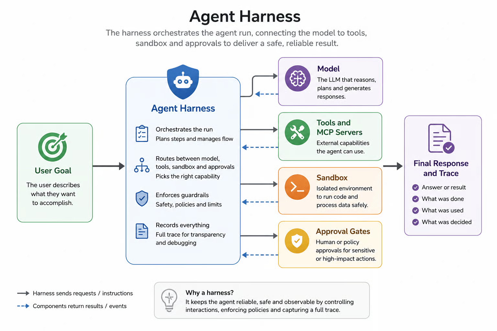
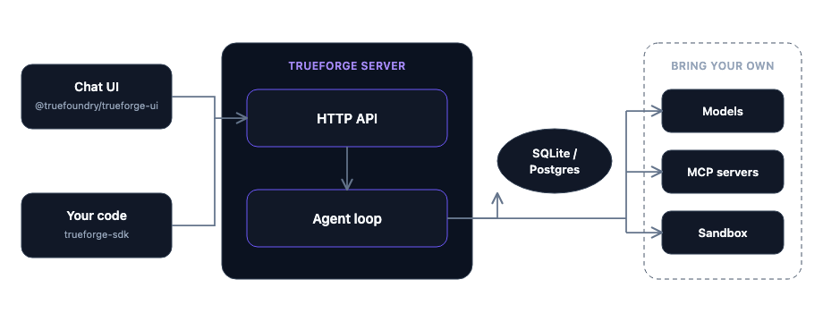
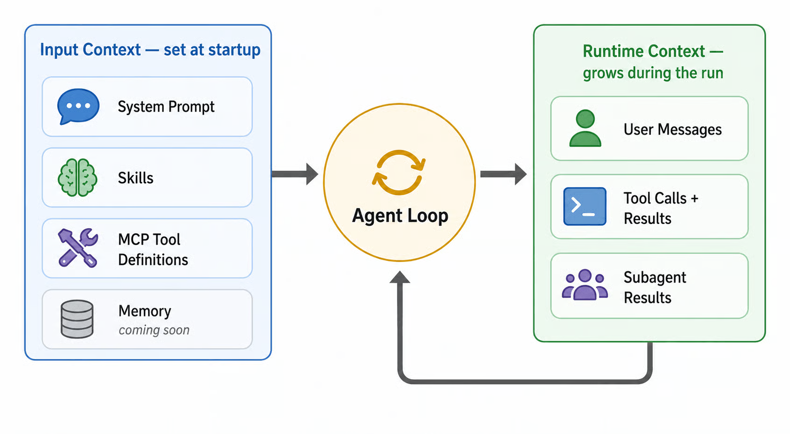

# Advanced RAG / Agent Interview Q&A — DataXight Prep
## Bám theo project NL-to-SQL Agent / LAAF (Fabrion)

> `[ĐIỀN]` = chỗ cần điền số liệu/chi tiết thật từ project của bạn (7 deterministic score, model routing cụ thể, pass rate...). Khung câu trả lời dưới đây là best-practice chuẩn ngành, bạn ghép case thật vào sẽ mạnh hơn nhiều.

---
## What is an agent harness?
An agent harness is the runtime layer around an LLM that turns it into a reliable, long-running agent. Instead of only generating text, the harness runs the full execution loop — planning, tool routing and execution, context management for long tasks, security boundaries like sandboxing and human-in-the-loop approvals, and session state that survives reconnects and restarts.



** What is TrueForge? ** 

TrueForge is an open-source agent harness with three parts: a core server that runs the agent loop, an HTTP API (with a TypeScript SDK) to drive it from code, and a chat UI (with a React UI SDK) to drive it from the browser.




## 1. Recall@k cao nhưng answer sai — xác định lỗi ở reranking, context construction, hay generation bằng cách nào?

**Phương pháp: cô lập từng khâu bằng cách "đóng băng" các khâu khác.**

1. **Tách retrieval khỏi ranking**: Log lại toàn bộ candidate set trước khi rerank (top-50 thô). Kiểm tra chunk đúng có nằm trong top-50 không (`context_recall`). Nếu có → retrieval OK, vấn đề nằm ở downstream.

2. **Kiểm tra ranking riêng**: Xem vị trí (rank position) của chunk đúng sau khi rerank. Nếu chunk đúng tụt từ rank 3 xuống rank 15 sau reranker → lỗi reranker (model reranking kém, hoặc scoring function không phù hợp domain — VD: reranker general-purpose không hiểu thuật ngữ chuyên ngành bioinformatics).

3. **Kiểm tra context construction riêng (tách khỏi generation)**: Log lại **prompt cuối cùng thực sự gửi cho LLM** (không phải chunk raw). Kiểm tra:
   - Chunk đúng có thực sự lọt vào prompt không, hay bị cắt do token limit?
   - Format context có rõ ràng không (có metadata, có bị truncate giữa câu không)?
   - Vị trí chunk trong prompt (đầu/giữa/cuối) — nếu ở giữa 1 prompt dài, nghi ngờ "lost in the middle".

4. **Kiểm tra generation riêng bằng controlled test**: Lấy đúng context (đã xác nhận chứa thông tin đúng, ở vị trí tốt) và tự tay đưa vào prompt (bypass toàn bộ retrieval pipeline), hỏi LLM trực tiếp. Nếu LLM vẫn trả lời sai → chắc chắn là generation/grounding, không phải retrieval hay ranking. Đo bằng `faithfulness` (RAGAS) — answer có bám đúng context được cấp hay đang dùng parametric knowledge.

**Kết luận nhanh theo bảng quyết định:**

| Chunk đúng trong top-50? | Chunk đúng trong prompt cuối? | LLM answer đúng khi ép context sạch? | → Lỗi ở đâu |
|---|---|---|---|
| Không | — | — | Retrieval (embedding/query) |
| Có | Không | — | Reranking hoặc context construction (token limit, truncation) |
| Có | Có | Không | Generation/grounding |
| Có | Có | Có (nhưng pipeline thật vẫn sai) | Context construction — format/order gây "lost in the middle" |

Kỹ thuật debug: **replay/log toàn bộ pipeline theo từng bước** (candidate set → reranked set → final prompt → answer), không chỉ log input/output cuối cùng — đây là điều bắt buộc phải build ngay từ đầu để debug được, không phải fix sau.

---

## 2. Retrieval trả về context không liên quan/rỗng — Agent (NL-to-SQL, Document Extract) xử lý thế nào? Trả lời "không biết" hay vẫn cố generate?

**Nguyên tắc thiết kế: abstain (từ chối trả lời) phải là một hành vi được lập trình rõ ràng, không phải phó mặc cho LLM tự quyết.**

- **NL-to-SQL Agent**:
  - Nếu retrieval của schema/table metadata trả về rỗng hoặc similarity dưới ngưỡng → agent **không được generate SQL mù**. Thay vào đó:
    1. Trả về câu hỏi làm rõ cho user ("Không tìm thấy bảng/field phù hợp với câu hỏi, bạn có thể cho biết cụ thể hơn không?").
    2. Hoặc fallback sang **broader search** (mở rộng threshold, thử full-text search trên schema catalog) trước khi báo abstain.
  - Nếu vẫn generate SQL, **bắt buộc chạy qua validation layer** trước khi return: kiểm tra SQL có reference đến table/column tồn tại trong schema catalog thật không (static validation, không cần chạy query) — đây là cơ chế chặn hallucination ở tầng deterministic, không dựa vào LLM tự biết mình sai.

- **Document Extract Agent**:
  - Nếu context rỗng hoặc confidence thấp → trả về field **null có gắn flag** (VD: `"value": null, "confidence": "low", "reason": "no_matching_context"`) thay vì để LLM tự bịa giá trị hợp lý (rất nguy hiểm với dữ liệu structured, VD: extract số liệu tài chính, thông tin bệnh nhân).
  - Prompt engineering: chỉ thị rõ ràng "Nếu không tìm thấy thông tin trong context được cung cấp, trả về null, KHÔNG suy đoán" — nhưng đây chỉ là lớp phòng vệ đầu tiên, không đủ tin cậy 100%.

**Điểm mấu chốt**: Không dựa vào việc "prompt LLM nói không biết" làm cơ chế chính, vì LLM vẫn có xác suất hallucinate ngay cả khi được chỉ thị rõ. Cần **lớp kiểm tra deterministic bên ngoài LLM** (schema validation, confidence threshold, rule-based check) làm gate cuối cùng trước khi trả kết quả cho user.

---

## 3. Semantic layer đổi schema, retrieval point vào field không còn tồn tại — có cơ chế invalidate tự động không, hay phải chạy lại thủ công?

**Nên có cơ chế tự động, không nên phụ thuộc vận hành thủ công — vì đây chính là failure mode âm thầm nguy hiểm nhất (silent staleness).**

Thiết kế đề xuất:

1. **Schema versioning + hash fingerprint**: Mỗi lần index metadata/schema vào vector DB, lưu kèm hash của schema definition (VD: hash của DDL hoặc field list). Khi semantic layer đổi schema, hash thay đổi → trigger tự động re-index phần liên quan.

2. **Event-driven invalidation**: Nếu semantic layer publish schema change event (qua message queue, hoặc CDC — change data capture, nếu dùng Iceberg thì có thể lắng nghe snapshot/schema evolution event), pipeline lắng nghe event này và tự động:
   - Đánh dấu các vector embedding liên quan đến field cũ là stale.
   - Trigger re-embedding cho phần schema mới.

3. **Runtime validation làm lớp bảo vệ thứ 2** (phòng trường hợp invalidation tự động bị miss): Trước khi execute SQL/query dựa trên retrieval result, validate field/table đó có tồn tại trong schema catalog **live** (query trực tiếp catalog, không dựa vào cache embedding) — nếu không tồn tại, trigger re-index on-demand cho phần đó thay vì fail cứng.

4. **TTL (time-to-live) cho embedding metadata** làm safety net cuối: Nếu không có event-driven pipeline hoàn chỉnh, đặt TTL để định kỳ re-validate/re-index toàn bộ, tránh schema drift tích luỹ âm thầm qua thời gian.

→ Trả lời phỏng vấn nên nhấn: **không nên chỉ dựa vào 1 cơ chế** — kết hợp event-driven (nhanh, chủ động) + runtime validation (an toàn, bắt được case bị miss) là thiết kế chắc chắn nhất.

**[ĐIỀN]:** Fabrion có build cơ chế này chưa hay đang chạy thủ công? Nếu thủ công, đây là điểm bạn có thể đề xuất cải tiến — rất tốt để show critical thinking trong interview.

---

## 4. Agent có quyền gọi API — làm sao ngăn gọi API nguy hiểm/sai mà vẫn giữ tính tự chủ?

**Nguyên tắc: tự chủ trong lựa chọn hành động, nhưng bị ràng buộc (constrained) trong phạm vi hành động được phép.**

1. **Tool allowlist + scoped permission**: Agent chỉ được thấy/gọi tập tool đã được whitelist theo context (VD: agent xử lý read-only query không có quyền gọi tool DELETE/UPDATE). Không expose toàn bộ API surface cho agent tự quyết định.

2. **Risk tiering cho từng tool/API**:
   - **Tier 1 (an toàn, tự động)**: Read-only, không side-effect → agent tự gọi không cần confirm.
   - **Tier 2 (rủi ro trung bình)**: Có side-effect nhưng reversible (VD: tạo draft, gửi email nội bộ) → agent gọi nhưng log lại, có thể rollback.
   - **Tier 3 (rủi ro cao, irreversible)**: Xoá dữ liệu, gọi API tài chính, gửi thông báo ra ngoài → **bắt buộc human-in-the-loop confirm** trước khi execute, agent không được tự động hoá hoàn toàn.

3. **Pre-execution validation (guardrail layer riêng biệt với LLM)**: Trước khi thực thi tool call mà agent chọn, chạy qua lớp kiểm tra deterministic:
   - Tham số có hợp lệ theo schema của API không (type check, range check).
   - Có match với pattern nguy hiểm đã biết không (VD: SQL injection pattern, API call với parameter bất thường so với baseline).

4. **Sandboxing / dry-run trước production**: Với action có rủi ro, chạy dry-run (simulate) trước, so sánh kết quả dự kiến với expectation, chỉ thực thi thật nếu dry-run pass.

5. **Rate limiting & circuit breaker**: Giới hạn số lần agent được gọi 1 tool trong 1 phiên (tránh loop lỗi gọi API liên tục), và circuit breaker tự động ngắt nếu phát hiện pattern bất thường (VD: agent gọi cùng 1 API sai liên tục nhiều lần).

6. **Audit log đầy đủ**: Mọi tool call (kể cả bị chặn) đều log lại — vừa để debug, vừa để cải thiện guardrail sau này.

→ Framing quan trọng: **Guardrail không nên nằm trong prompt** (dễ bị bypass qua prompt injection hoặc LLM tự "quên" chỉ thị) mà phải nằm ở **lớp code bên ngoài LLM**, đóng vai trò gate bắt buộc.

---

## 5. LLM-as-judge đánh giá agent pass 95%, nhưng user thực tế đánh giá pass rate ~60% — vấn đề gì có thể xảy ra trong evaluation framework?

Đây là dấu hiệu kinh điển của **evaluation-reality gap**. Các nguyên nhân phổ biến:

1. **Judge prompt không phản ánh đúng tiêu chí user thực sự quan tâm** — judge có thể đang chấm theo tiêu chí hẹp (VD: "SQL có syntactically đúng không") trong khi user quan tâm "kết quả có đúng ý định nghiệp vụ không". Cần audit lại rubric của judge có match với real user acceptance criteria không.

2. **Golden test set không đại diện cho phân bố câu hỏi thật (distribution shift)** — test set có thể tập trung vào case dễ/phổ biến, trong khi user hỏi nhiều edge case, câu hỏi ambiguous, hoặc câu hỏi ngoài phạm vi schema đã train — judge chưa từng thấy loại case này nên không đánh giá đúng.

3. **Judge bị leniency bias / self-preference bias** — nếu judge model cùng họ với model được đánh giá (VD: GPT judge GPT), có xu hướng chấm cao hơn thực tế do thiên vị style output quen thuộc.

4. **Judge thiếu ground truth thật, chỉ đánh giá "nghe có vẻ hợp lý" (plausibility) thay vì "đúng thực tế"** — đặc biệt nguy hiểm với NL-to-SQL: SQL có thể chạy được, trông hợp lý, nhưng trả về sai kết quả (VD: sai điều kiện JOIN, sai aggregation) — nếu judge chỉ nhìn "SQL execute không lỗi" mà không so kết quả với ground truth, sẽ overestimate pass rate rất nhiều.

5. **User đánh giá theo tiêu chuẩn khắt khe hơn/khác góc nhìn** — user có thể fail case vì lý do ngoài phạm vi correctness (VD: đúng nhưng chậm, đúng nhưng UX khó hiểu, đúng nhưng thiếu context giải thích) — cần làm rõ user đang đo "correctness" hay "overall satisfaction".

**Cách khắc phục:** Chạy **calibration study** — lấy 1 tập sample (VD: 100 case), có cả judge score và user score, tính correlation. Nếu correlation thấp, drill down từng case bất đồng để tìm pattern lỗi cụ thể (thường sẽ lộ ra 1-2 nguyên nhân chính ở trên) rồi sửa rubric/test set, không nên tiếp tục tin vào judge score cho tới khi calibrate lại.

---

## 6. LLM-as-judge qua LiteLLM — dùng 2 model khác nhau hay 1 model chạy 2 lần temperature khác? Nếu bất đồng, quyết định cuối theo cơ chế nào?

**Khuyến nghị: 2 model khác nhau (cross-model judge) tốt hơn 1 model chạy 2 lần khác temperature**, vì lý do:

- Cùng 1 model dù đổi temperature vẫn mang chung "blind spot" — nếu model đó có xu hướng đánh giá sai 1 loại lỗi nhất định (VD: không nhận ra lỗi JOIN logic tinh vi), chạy 2 lần khác temperature vẫn lặp lại cùng loại lỗi đó → không thực sự tăng độ tin cậy, chỉ giảm variance do randomness chứ không giảm bias hệ thống.
- 2 model khác họ (VD: Claude + GPT, hoặc thêm 1 model open-source như Llama/DeepSeek làm tie-breaker) giúp bắt lỗi đa dạng hơn vì mỗi model có bias/blind spot khác nhau.

**Cơ chế xử lý bất đồng (disagreement resolution):**

1. **Agreement threshold**: Nếu 2 judge đồng thuận (cả 2 pass hoặc cả 2 fail) → chấp nhận kết quả, không cần xử lý thêm.
2. **Khi bất đồng**: 
   - **Option A — Third judge (tie-breaker)**: Gọi judge thứ 3 (model khác) để quyết định theo majority vote (2/3).
   - **Option B — Escalate to human review**: Với case có stake cao (VD: agent liên quan đến dữ liệu nhạy cảm), bất đồng giữa 2 judge nên được coi là tín hiệu "case khó/ambiguous" và đẩy sang human review thay vì tự động resolve — vì bất đồng giữa 2 model thường tương quan với case thực sự khó đánh giá.
   - **Option C — Weighted scoring theo track record**: Nếu đã có lịch sử calibration (judge nào chính xác hơn theo human ground truth trong quá khứ), có thể weight điểm của judge đáng tin hơn cao hơn thay vì coi 2 judge ngang hàng.
3. **Log toàn bộ case bất đồng để phân tích định kỳ** — tần suất bất đồng cao ở 1 loại câu hỏi nào đó là tín hiệu cần cải thiện rubric hoặc bổ sung thêm ground truth cho loại đó.

**[ĐIỀN]:** Ở Fabrion bạn dùng LiteLLM route tới model nào làm judge cụ thể (Claude + GPT? có Llama/DeepSeek tham gia không)?

---

## 7. Các model đã dùng (Claude, GPT, Llama, DeepSeek) trong Fabrion — model nào dùng cho phần nào?

Khung trả lời gợi ý theo nguyên tắc **chọn model theo đặc tính task, không theo "model tốt nhất chung chung"**:

| Task | Model gợi ý | Lý do |
|---|---|---|
| Reasoning phức tạp, code generation (Pandas→Spark migration, SQL generation logic phức tạp) | Claude (Sonnet) | Mạnh về structured reasoning, code quality, tuân thủ system prompt/constraint chặt chẽ — quan trọng khi cần agent bám đúng schema/rule. |
| Judge/evaluation thứ 2 (cross-model judge, giảm bias) | GPT | Đóng vai trò judge độc lập với model chính, giúp phát hiện lỗi mà Claude có thể bỏ sót do cùng 1 "style" reasoning. |
| Task đơn giản, tần suất cao, cần latency thấp/chi phí thấp (classification, extraction đơn giản, routing) | Llama (self-host hoặc qua API rẻ) | Tối ưu chi phí/tốc độ cho task không cần reasoning sâu, có thể fine-tune riêng nếu cần. |
| Thử nghiệm/so sánh reasoning hiệu năng-chi phí, hoặc use case cần chạy on-prem (data nhạy cảm không ra khỏi hạ tầng nội bộ) | DeepSeek | Chi phí thấp, có thể self-host, phù hợp với dữ liệu life sciences nhạy cảm cần kiểm soát chặt nơi xử lý dữ liệu. |

**[ĐIỀN — quan trọng]:** Đây là bảng khung, bạn cần điền chính xác model nào Fabrion thực sự dùng cho phần nào (NL-to-SQL generation dùng model gì, judge dùng model gì, extraction dùng model gì) — phỏng vấn viên sẽ hỏi sâu "tại sao chọn model X cho task Y" nên cần trả lời được lý do thật, không chỉ lý thuyết.

---

## 8. NL-to-SQL Agent và LAAF — xây bằng LangChain hay tự viết hoàn toàn?

Khung trả lời (điều chỉnh theo thực tế bạn đã làm — theo memory, project có liên quan đến **NOOA (NVIDIA Object-Oriented Agents) framework** và **Pi.dev**):

- Nếu dùng NOOA/framework custom: nhấn mạnh lý do **không chọn LangChain thuần** — thường là vì cần kiểm soát chặt hơn về structure (Object-Oriented Agent design), dễ test/debug hơn so với chain trừu tượng của LangChain, và tránh overhead/abstraction không cần thiết khi logic nghiệp vụ (NL-to-SQL) đòi hỏi control flow rõ ràng, có thể trace từng bước (quan trọng cho **Loop Engineering** và **two-tier evaluation harness** — cần hook vào từng step để đánh giá).
- Có thể vẫn dùng LangChain cho các phần hạ tầng chuẩn (document loader, text splitter, vector store connector) nhưng **tự viết agent orchestration logic** thay vì dùng AgentExecutor có sẵn — đây là pattern phổ biến khi cần custom evaluation/observability sâu.

**[ĐIỀN]:** Xác nhận lại — LAAF (Loop-Augmented Agent Framework? hay tên viết tắt khác) là tên bạn đặt cho framework tự xây dựng phải không? Nếu đúng, kể rõ: dùng LangChain ở phần nào, tự viết phần nào, và lý do kỹ thuật cụ thể (không chỉ "muốn kiểm soát hơn" mà là case cụ thể LangChain không đáp ứng được).

---

## 9. Đã dùng LangChain để xử lý multi-step agent — có gặp giới hạn so với LangGraph không?

Khung trả lời nếu đã trải nghiệm giới hạn này (rất phổ biến trong ngành, nên trả lời thật với ví dụ cụ thể sẽ mạnh):

**Giới hạn thường gặp của LangChain với multi-step, stateful agent:**
- **Khó biểu diễn state machine phức tạp**: LangChain's AgentExecutor về cơ bản là vòng lặp ReAct tuyến tính (think → act → observe), khó biểu diễn được branching logic phức tạp (VD: agent cần quay lại bước trước nếu 1 nhánh fail, hoặc chạy song song nhiều nhánh rồi merge kết quả).
- **Khó control lại trạng thái giữa các bước**: State bị ẩn trong chain, khó inject/override state giữa chừng để test hoặc debug từng bước riêng lẻ.
- **Khó implement human-in-the-loop giữa các bước** một cách tự nhiên (cần dừng agent, chờ human input, rồi resume đúng state) — đây chính là điểm LangGraph được thiết kế để giải quyết (graph-based state machine, có checkpoint/resume built-in).
- **Retry/error handling per-step khó customize** — LangChain thường retry toàn bộ chain thay vì retry đúng step bị lỗi.

**Nếu gặp giới hạn này**, hướng xử lý thường là:
1. Tự viết orchestration logic dạng state machine (giống ý tưởng LangGraph nhưng tự implement) — đây có thể chính là lý do bạn xây LAAF/dùng NOOA thay vì thuần LangChain.
2. Hoặc migrate sang LangGraph cho phần cần multi-step phức tạp, giữ LangChain cho phần đơn giản (RAG retrieval chain).

**[ĐIỀN]:** Bạn có thực sự gặp giới hạn cụ thể nào (kể case thật: "agent cần quay lại bước SQL generation nếu execution fail, LangChain AgentExecutor không hỗ trợ tốt việc này nên em phải tự viết retry loop có state riêng") — case cụ thể này rất quan trọng để trả lời thuyết phục.

---

## 10. Pass rate từ 0.14 lên 0.93 trong NL-to-SQL — 7 deterministic score là gì?

**Khung 7 deterministic metric phổ biến cho NL-to-SQL evaluation (bạn đối chiếu và điền lại đúng 7 metric thật đã dùng):**

1. **Exact Match (EM)** — SQL generate giống hệt (chuẩn hoá whitespace/case) với SQL ground truth. Rất chặt, dễ false-negative (2 SQL khác cú pháp nhưng cùng kết quả vẫn bị tính fail).
2. **Execution Accuracy (EX)** — Chạy SQL generate và SQL ground truth trên cùng database, so sánh **kết quả trả về** thay vì so cú pháp — metric quan trọng nhất vì phản ánh đúng "trả lời đúng câu hỏi" chứ không quan tâm cách viết.
3. **Schema Linking Accuracy** — Đo việc agent có chọn đúng table/column liên quan hay không (trước cả khi ra SQL) — tách riêng lỗi "hiểu sai schema" khỏi lỗi "viết sai cú pháp SQL".
4. **Component Match (theo mệnh đề SQL)** — So khớp riêng từng phần: SELECT clause, WHERE clause, JOIN clause, GROUP BY, ORDER BY — giúp biết agent sai ở phần nào cụ thể (VD: luôn đúng SELECT nhưng hay sai JOIN condition).
5. **Syntactic Validity** — SQL có chạy được (không lỗi syntax) hay không, tách biệt khỏi việc đúng logic — vì SQL có thể chạy được nhưng sai kết quả, hoặc ngược lại lỗi syntax nhỏ dễ fix.
6. **Row-count / Aggregate Checksum Match** — Với câu hỏi dạng aggregation (COUNT, SUM, AVG), so sánh giá trị số cuối cùng — nhạy hơn EM, dung sai với cách viết SQL khác nhau miễn ra cùng số.
7. **Latency / Cost per query (secondary metric)** — Không phải correctness nhưng thường đưa vào bộ đánh giá tổng thể để đảm bảo cải thiện accuracy không đánh đổi bằng chi phí/tốc độ không chấp nhận được.

**Vì sao pass rate tăng mạnh 0.14 → 0.93** — framing thường theo các cải tiến sau (điền lại đúng thứ tự/nguyên nhân thật bạn đã làm):
- Cải thiện **schema linking** (retrieval đúng table/column trước khi generate SQL) — thường là bước cải thiện lớn nhất vì lỗi gốc thường không phải ở SQL syntax mà ở việc agent "không biết" field nào đúng.
- Thêm **self-correction loop**: chạy thử SQL, nếu lỗi execution, feed error message ngược lại cho LLM để tự sửa (Loop Engineering).
- Thêm **few-shot example** theo schema thực tế (không dùng generic SQL example) vào prompt.
- Validation layer chặn SQL reference sai field trước khi return (giảm hard-fail).

**[ĐIỀN — bắt buộc]:** Đây là con số rất cụ thể (0.14 → 0.93) nên gần như chắc chắn phỏng vấn viên sẽ hỏi sâu "cải thiện từng bước ra sao, đâu là cải tiến đóng góp nhiều nhất". Bạn cần nhớ lại đúng 7 metric thật đã dùng (không nhất thiết trùng khung trên) và câu chuyện cải thiện theo từng giai đoạn (không phải 1 bước nhảy vọt, mà thường là chuỗi cải tiến từng phần — kể theo timeline sẽ thuyết phục hơn).

---

## 11. Case study: RAG/Multi-agent cho 100 khách hàng, mỗi khách hàng có bộ data riêng — thiết kế isolation ở tầng dữ liệu, vector DB, agent context như thế nào?

**Nguyên tắc chung: isolation phải có ở NHIỀU tầng (defense in depth), không chỉ dựa vào 1 tầng duy nhất — vì đây là vấn đề bảo mật/compliance nghiêm trọng nếu leak chéo dữ liệu giữa khách hàng.**

**Tầng dữ liệu (storage):**
- **Multi-tenancy pattern lựa chọn theo mức độ nhạy cảm**:
  - *Silo model* (mỗi khách hàng 1 database/storage bucket riêng — VD: MinIO bucket riêng per-tenant) — an toàn nhất, phù hợp khách hàng enterprise/dữ liệu rất nhạy cảm (life sciences, y tế), nhưng chi phí vận hành cao hơn.
  - *Pool model với tenant_id* (chung storage, filter theo tenant_id ở mọi query) — tiết kiệm chi phí hơn, nhưng rủi ro nếu có bug ở tầng filter (1 lỗi code có thể leak toàn bộ khách hàng).
  - Với 100 khách hàng, có thể **hybrid**: silo cho khách hàng lớn/nhạy cảm, pool có row-level security cho khách hàng nhỏ.

**Tầng vector database:**
- **Namespace/collection riêng per-tenant** (hầu hết vector DB hiện đại — Pinecone, Weaviate, Qdrant, Milvus — đều hỗ trợ namespace) — đảm bảo query luôn scope theo namespace, không thể vô tình retrieve chéo dù embedding có gần nhau về semantic.
- Tuyệt đối **không dùng metadata filter làm cơ chế isolation duy nhất** (VD: filter theo `tenant_id` trong metadata) — vì đây là "soft isolation", 1 bug ở tầng application (quên add filter) sẽ leak dữ liệu ngay. Namespace/collection riêng là "hard isolation" ở tầng infra.
- Embedding model có thể **fine-tune riêng per-tenant** nếu domain vocabulary khác biệt lớn (tuỳ ngân sách), hoặc dùng chung 1 embedding model nhưng tuyệt đối tách index.

**Tầng agent/context:**
- **Session/context không được share giữa request của các tenant khác nhau** — mỗi agent invocation phải nhận `tenant_id` như 1 tham số bắt buộc ngay từ đầu pipeline (không suy luận ngầm), và mọi tool call (kể cả gọi API nội bộ, query DB) đều phải truyền kèm tenant scope.
- **Prompt/system context không được leak thông tin tenant khác** — kể cả trong few-shot example dùng trong prompt (nếu dùng example thật từ data khách hàng A để làm few-shot cho khách hàng B, đó là leak).
- **Rate limit & resource quota per-tenant** (tránh 1 khách hàng dùng nhiều tool call/API quá mức ảnh hưởng tenant khác — "noisy neighbor" problem).

**Kiểm tra & compliance:**
- **Automated test giả lập cross-tenant query** chạy định kỳ trong CI — chủ động thử retrieve chéo để confirm isolation hoạt động đúng, không chỉ tin vào thiết kế.
- **Audit log per-tenant** để trace lại nếu có sự cố, phục vụ compliance (đặc biệt quan trọng nếu khách hàng thuộc ngành y tế/tài chính có yêu cầu regulatory).

---

## 12. 10 tools, LLM chọn sai tool — làm sao cải thiện?

**Chẩn đoán trước khi fix — chọn sai tool thường do 1 trong các nguyên nhân sau:**

1. **Tool description không rõ ràng/overlap nhau** — nếu 2 tool có description mơ hồ, dễ giống nhau (VD: "search_data" và "query_database" nghe tương tự), LLM sẽ nhầm lẫn. → **Fix**: viết lại description cực kỳ cụ thể, có ví dụ input/output rõ ràng cho từng tool, đảm bảo ranh giới sử dụng không chồng lấn.

2. **Quá nhiều tool trong 1 lần gọi (tool overload)** — LLM có xu hướng chọn sai khi phải cân nhắc quá nhiều lựa chọn cùng lúc. → **Fix**: **phân nhóm/tiered tool selection** — bước 1 dùng 1 router nhỏ (có thể là 1 LLM call riêng hoặc classifier nhẹ) để chọn nhóm tool phù hợp trước, sau đó mới cho agent chọn cụ thể trong nhóm nhỏ hơn (giảm từ 10 xuống 2-3 lựa chọn mỗi lần).

3. **Thiếu few-shot example minh hoạ cách chọn tool đúng** trong system prompt — bổ sung 3-5 ví dụ "câu hỏi này → tool này" giúp LLM học pattern rõ hơn là chỉ dựa vào description.

4. **Không có feedback loop khi chọn sai** — nếu tool trả về lỗi/kết quả không phù hợp, agent nên được thiết kế để **tự nhận diện signal đó và thử tool khác** (retry with different tool) thay vì dừng lại hoặc trả kết quả sai.

5. **Đo lường bằng metric riêng: Tool Selection Accuracy** — tách biệt khỏi overall task success, để biết chính xác vấn đề nằm ở chọn tool hay ở việc dùng tool đúng cách sau khi chọn đúng. Xây golden test set riêng cho tool-selection (câu hỏi → tool đúng kỳ vọng) để đo và cải thiện độc lập.

6. **Fine-tune hoặc dùng model nhỏ chuyên biệt cho routing** nếu overall accuracy vẫn không đủ — với hệ thống có nhiều tool cố định và pattern lặp lại, 1 classifier nhỏ (không cần LLM lớn) train riêng cho việc chọn tool có thể chính xác và rẻ hơn nhiều so với để LLM lớn tự quyết định mỗi lần.

---

## Ghi chú tổng
Các câu 7, 8, 9, 10 gắn trực tiếp với số liệu/kiến trúc thật của Fabrion (`[ĐIỀN]`) — đây là nhóm câu hỏi phỏng vấn viên chắc chắn sẽ hỏi sâu tiếp ("tại sao", "case cụ thể nào", "con số đó tính thế nào"), nên bạn cần chuẩn bị kỹ phần story thật, không chỉ trả lời khung lý thuyết.


## Harness Capabilities
Sandbox-as-tool, context engineering, human checkpoints, and Generative UI — how TrueForge keeps agents reliable and efficient.

TrueForge is more than model + tools. These harness features keep long agent runs accurate, cheaper, and safer.

- ** Sandbox as a tool ** : 	Isolated code/file execution without putting secrets or the agent loop inside the sandbox
- ** Context engineering ** : 	Progressive skills, deferred tools, subagents, offloading, Code Mode, compaction
- ** Tool approval **:	Pause before write/destructive MCP tools
- ** Ask clarifying questions** : 	Structured clarification mid-run
Generative UI	Charts, tables, and cards streamed into chat
- ** In-chat MCP OAuth **	Connect button when a connector needs authorization
​
## Sandbox as a tool
Unlike harnesses that run the whole agent inside a VM, TrueForge keeps the agent loop on the server and uses the sandbox only for code, files, and shell. Secrets stay out of the sandbox; compute is provisioned only when needed. Skills and Code Mode require it.
​
## What is context engineering?
Context engineering is providing the right information in the right format so an agent can finish the job reliably. In TrueForge, context is everything the model sees on each step — instructions, skills, MCP tool definitions, conversation history, and tool results.

Getting that balance wrong hurts quality:
- ** Too little context ** — the agent lacks what it needs and answers poorly.
- ** Too much context ** — the window fills with noise, reasoning degrades, and cost/latency climb.

TrueForge manages the balance with layered strategies. Think of context in two phases:




## Input context
Input context is everything the model receives at the start of a run. It is mostly static across runs of the same agent — you configure it once and the harness loads it every time. The smaller and more focused your input context, the more room the model has to reason.

## Runtime context
Runtime context is everything added to the model’s context as the run progresses:

- ** User messages ** 	Whatever the user sends, including follow-ups in a multi-turn conversation
- ** Assistant messages ** 	The model’s reasoning and replies on each step
- ** Tool calls ** 	Each tool invocation made by the agent, with its arguments
- ** Tool results **	Whatever the tool returns — JSON payloads, file contents, search results, errors
- ** Subagent outputs **	Final results returned from delegated subagents

Runtime context is where most of the context bloat problem happens. A single tool call returning a 50,000-token JSON payload, or a long conversation with dozens of intermediate steps, can quickly approach the model’s limit. This is the part the harness actively manages.
​

## Subagents — context isolation
Subagents isolate heavy work. When the root agent spawns a subagent:
The subagent runs with its own fresh context — instructions and tools, but no shared message history.
It executes autonomously, makes its own tool calls, and produces a final result.
Only the final result returns to the root agent. Intermediate tool calls, large search results, and reasoning steps never enter the root’s context.
This is especially valuable for tasks that touch many entities or require many tool calls. For example, summarizing PRs across a 10-person team can fan out to 10 subagents in parallel — the root agent collects 10 short summaries instead of 10 sets of raw tool output. 

The agent can then use sandbox tools to inspect the file, infer its schema, extract specific fields, or filter the data — all without the raw payload ever entering the conversation. See Large Tool Responses.
​
## Code Mode — process tool output in code
For tasks that involve aggregating, filtering, or transforming tool output (counts, group-bys, joins across multiple tool calls), Code Mode lets the agent run a Python script in the sandbox that calls MCP tools directly. The script processes the data in code and prints only the summary.
This avoids two failure modes at once:
- Context bloat — raw tool output never enters context, only the printed result.
- Hallucinated arithmetic — counts, sums, and group-bys are computed in code, not inferred from prose.
​
## Context compaction
When the conversation grows longer than offloading alone can manage, the harness triggers compaction. Compaction is enabled by default and kicks in when the active context crosses a token threshold (default 50,000 tokens, configurable per agent).

An LLM generates a structured summary of the conversation so far — the original intent, key decisions, files and artifacts, errors and fixes, and next steps — and that summary replaces the older message history in the agent’s working context, freeing tokens for continued reasoning.

Compaction is lossy in the working context — fine-grained details from earlier messages are condensed into the summary. The full event history of the session remains persisted and queryable via the session events API, but the agent works from the summary after compaction.

Configuration:

```
{
  "config": {
    "context_management": {
      "compaction": {
        "enabled": true,
        "compaction_threshold_tokens": 50000
      }
    }
  }
}
​
```
## How the strategies compose
In practice, these strategies stack. A single agent run might:
- Start with preload off, so only a handful of tool schemas are in input context.
- Delegate a research subtask to a subagent that makes dozens of tool calls in isolation.
- Offload a large tool result inside the subagent to a sandbox file.
- Use Code Mode to aggregate the offloaded data into a small summary.
- Return the summary to the root agent — keeping the root’s runtime context clean.
- Compact the root agent’s history later if a long conversation crosses the threshold.